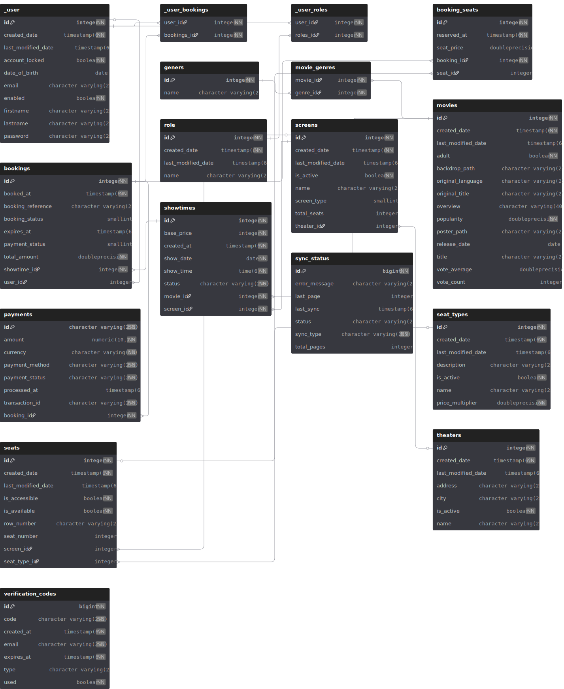

## ScreenMaster


<p align="center">
  
</p>

ScreenMaster is a Spring Boot backend for managing theaters, screens, seats, movies, and bookings, featuring integration with external services (TMDB for movie metadata, PayPal for payments) and email notifications for user flows (registration, verification, transactional updates).

---
### System Architecture Diagram


---

### Features
- **Movie management**: local catalog enriched from TMDB with scheduled sync.
- **Theater management**: theaters, screens, seats, seat types.
- **Search & sorting**: dynamic filtering via specifications.
- **Authentication & authorization**: JWT-based security.
- **Payments**: PayPal checkout integration.
- **Email notifications**: verification codes, transactional emails.
- **Resilient sync**: scheduled TMDB sync with status tracking and batching.

---

### Tech Stack
- **Backend**: Spring Boot 3, Spring Web, Spring Security, Spring Data JPA
- **Database**: PostgreSQL
- **Build**: Maven
- **Auth**: JWT
- **HTTP Client**: Spring `WebClient`
- **Scheduling**: Spring Scheduling
- **Email**: SMTP with templated HTML emails (Thymeleaf)
- **Message Queue**: RabbitMQ for asynchronous notifications
- **External Services**:
  - **TMDB**: movie metadata, genres
  - **PayPal**: payments.

---

### Architecture
- **Modules**
  - **Controllers**: REST endpoints, request validation
  - **Services**: business logic (movies, theaters, seats, sync, email, auth)
  - **Repositories**: JPA repositories for persistence
  - **DTOs**: request/response segregation for API stability
  - **Security**: JWT filters, authentication endpoints
  - **Scheduling**: periodic TMDB sync jobs

---


### Database Schema
This PostgreSQL database supports a comprehensive cinema booking system with the following core entities:- 

## Core Tables

**Movies & Content**
- `movies` - Movie information including title, overview, ratings, and metadata
- `geners` - Movie genres with many-to-many relationship via `movie_genres`

**Theater Infrastructure**
- `theaters` - Cinema locations with address and operational status
- `screens` - Individual screening rooms within theaters
- `seats` - Seat configuration with row/number positioning and accessibility features
- `seat_types` - Seat categories (e.g., standard, premium) with pricing multipliers

**Showtimes & Bookings**
- `showtimes` - Movie scheduling with date, time, pricing, and status tracking
- `bookings` - Customer reservations with payment status and expiration handling
- `booking_seats` - Junction table linking bookings to specific seats with pricing

**User Management**
- `_user` - Customer accounts with authentication and profile data
- `role` - User roles for authorization
- `verification_codes` - Email verification and password reset tokens

**Payments**
- `payments` - Transaction records supporting multiple payment methods (PayPal, Stripe, Card)

## Key Features

- **Seat Reservation System** - Prevents double-booking with unique constraints
- **Dynamic Pricing** - Base pricing with seat-type multipliers
- **Payment Integration** - Multi-provider payment processing
- **User Authentication** - Role-based access with email verification
- **Show Management** - Status tracking (scheduled, cancelled, sold out)
- **Audit Trail** - Created/modified timestamps on core entities

The schema uses PostgreSQL-specific features including check constraints for status validation and sequences for ID generation.




---


### Email Notifications
- **Flows**: registration verification, resend code.
- **Templates**: HTML templates under `src/main/resources/templates/email/`.
- **Message Queue**: RabbitMQ for asynchronous email processing and notifications.
- Configure SMTP via environment variables (see Configuration).

---

### Configuration
Set properties via environment variables or `src/main/resources/application.properties`.

- **Database (Postgres)**
  - `SPRING_DATASOURCE_URL=jdbc:postgresql://localhost:5432/screenmaster`
  - `SPRING_DATASOURCE_USERNAME=postgres`
  - `SPRING_DATASOURCE_PASSWORD=postgres`
- **JPA**
  - `SPRING_JPA_HIBERNATE_DDL_AUTO=update`
- **Security**
  - `JWT_SECRET=your_long_random_secret`
  - `JWT_EXPIRATION=3600000`
- **TMDB**
  - `TMDB_API_BASE_URL=https://api.themoviedb.org/3`
  - `TMDB_API_KEY=your_tmdb_api_key`
- **PayPal**
  - `PAYPAL_CLIENT_ID=your_paypal_client_id`
  - `PAYPAL_CLIENT_SECRET=your_paypal_client_secret`
  - `PAYPAL_MODE=sandbox`  (or `live`)
- **Email (SMTP)**
  - `SPRING_MAIL_HOST=smtp.yourprovider.com`
  - `SPRING_MAIL_PORT=587`
  - `SPRING_MAIL_USERNAME=your_email_username`
  - `SPRING_MAIL_PASSWORD=your_email_password`
  - `SPRING_MAIL_PROPERTIES_MAIL_SMTP_AUTH=true`
  - `SPRING_MAIL_PROPERTIES_MAIL_SMTP_STARTTLS_ENABLE=true`
  - `APP_MAIL_FROM=noreply@screenmaster.app`
- **RabbitMQ**
  - `SPRING_RABBITMQ_HOST=localhost`
  - `SPRING_RABBITMQ_PORT=5672`
  - `SPRING_RABBITMQ_USERNAME=guest`
  - `SPRING_RABBITMQ_PASSWORD=guest`


---

### Getting Started

Prerequisites:
- Java 21+
- Maven 3.9+
- PostgreSQL 17
- TMDB API key, PayPal credentials (sandbox for testing)
- SMTP credentials (for email features)

Run locally:
```bash
# 1) Set env vars (see Configuration) or copy `application.properties`
# 2) Create database
createdb screenmaster

# 3) Build & run
./mvnw clean spring-boot:run
```


---

### TMDB Sync
- Scheduled sync imports/updates movies and genres from TMDB.
- Tracks status in `SyncStatus` with last success/failure.
- Uses `WebClient` with API key auth.

---

### Security
- JWT-based authentication.
- Public endpoints for registration/login/verification.
- Role-based access for admin operations.

---


### Project Structure
```
src/main/java/com/gr74/ScreenMaster
  ├─ config/           # Security, WebClient, filters
  ├─ controller/       # REST endpoints
  ├─ dto/
  │  ├─ request/       # Input DTOs
  │  └─ response/      # Output DTOs
  ├─ model/            # JPA entities
  ├─ repository/       # Spring Data JPA repositories
  ├─ service/          # Business logic and integrations
  └─ specification/    # Dynamic filtering/search
src/main/resources
  ├─ application.properties
  └─ templates/email   # HTML templates for notifications
```

---

### Upcoming Features

- Adding Stripe as a payment service.
- Adding a Docker version of Screen Master.


